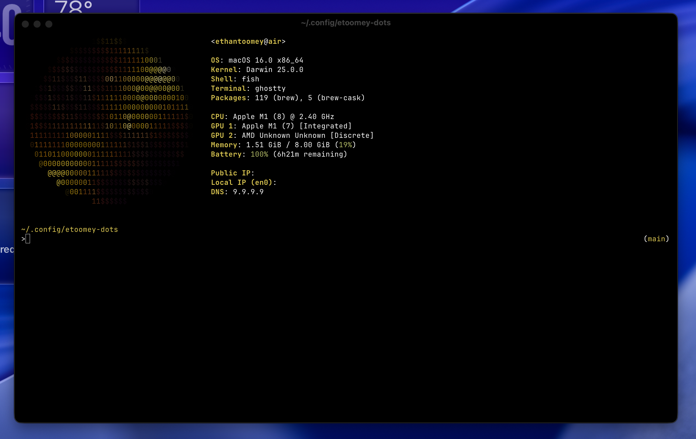

# dotfiles
`chezmoi init git@github.com:ethantoomey/dotfiles.git`

dotfiles configured for the following:
- [fastfetch](https://github.com/fastfetch-cli/fastfetch)
- [fish](https://github.com/fish-shell/fish-shell)
- [ghostty](https://github.com/ghostty-org/ghostty)

 

